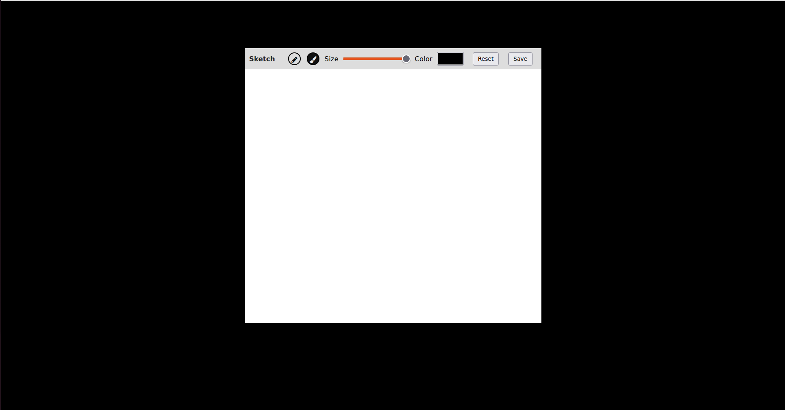

# Sketch App


[](https://www.youtube.com/watch?v=wad95WcOBpg)

## [LIVE  👁️](https://sketch-web.vercel.app/)

## Description

The Sketch App is a simple web-based application for creating sketches. It allows users to draw with either a pencil or a brush, adjust the size and color of the drawing tool, reset the canvas, and save their sketches as PNG images.

## Usage

```bash
# Navigate to the project directory
cd path/to/sketch-app
```
### Running Locally

To run the Sketch App, you can either:

1. Serve the project locally using a development server.
2. Open the index.html file directly in your web browser.

## Screenshots




